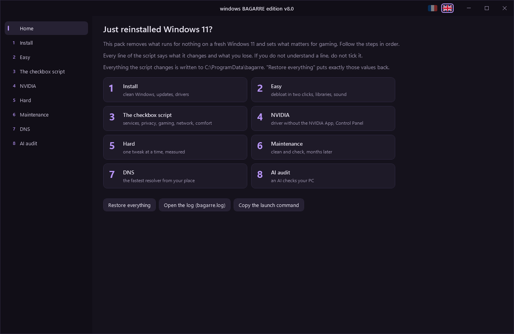

# windows bagarre edition

A window that debloats and tunes a freshly installed Windows 11 for gaming, in French or English.



## Run it

Open a Terminal (right-click Start > Terminal), paste this line and accept the administrator prompt:

```powershell
irm https://bagarre.mtsu.dev | iex
```

The command downloads the current version every time, there is nothing else to install. The window opens in the display language of Windows, and the two flags at the top switch it.

## What it does

Eight steps, in order:

1. Install: short file names off, Windows Update, chipset and network drivers.
2. Easy: Win11Debloat, WinUtil, the runtime libraries games need, sound settings.
3. The checkbox script: about 80 settings (services, privacy, gaming, network card, comfort). Each line says what it changes and what you lose. Every value is saved before it changes, and "Restore everything" puts it back.
4. NVIDIA or AMD, depending on the card: the driver without the extras, then the control panel settings.
5. Hard: priority and cores per game, memory, the GPU interrupt core.
6. Maintenance: startup programs, disk space, sleep problems, Defender while you play.
7. DNS: measures eight resolvers from your connection and applies the one you pick, with a fallback, DNS over HTTPS and IPv6.
8. AI audit: a read-only report of the PC and a prompt for the AI of your choice.

What the pack refuses to do, and why, is in [docs/decisions.md](docs/decisions.md).

## Repository

- `bagarre.ps1` is the file the command downloads. `build.ps1` generates it from `src/` and `textes/`, so edit those and rebuild.
- `src/` holds the PowerShell sources, `textes/fr` and `textes/en` the text of each page, `images/` the screenshots and button logos, `worker/` the Cloudflare Worker behind bagarre.mtsu.dev.
- To check the script without applying anything, or to render every page to PNG:

```powershell
& ([scriptblock]::Create([IO.File]::ReadAllText("bagarre.ps1", [Text.Encoding]::UTF8))) -Liste
& ([scriptblock]::Create([IO.File]::ReadAllText("bagarre.ps1", [Text.Encoding]::UTF8))) -Capture captures
```

The file is UTF-8 without BOM, which is why it is loaded this way rather than with `-File` on PowerShell 5.1. `-Amd` renders the AMD page, `-Vieux` the warning shown on an install older than a month.
